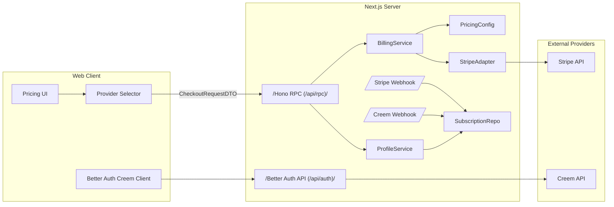
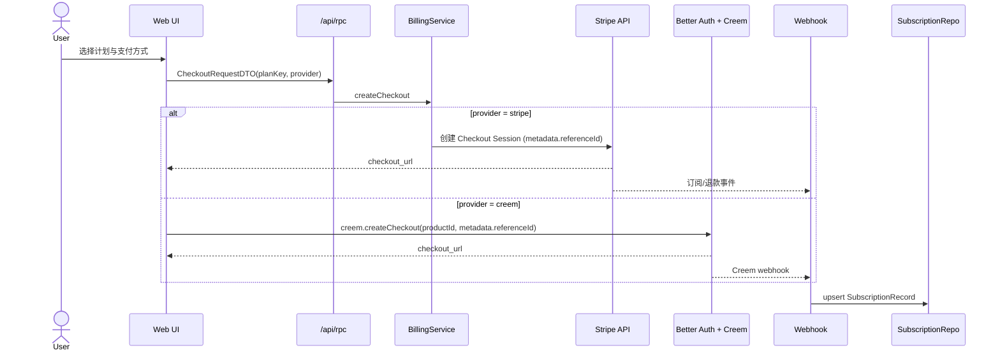
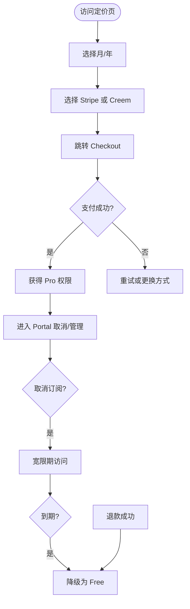

## Context
需要接入 Stripe 与 Creem 的订阅支付，并把订阅状态落地到本地数据库，用统一的 `isPro + plan` 供 `/api/rpc/me` 返回。试用期为 7 天（可配置），退款立即降级，取消订阅需等到期后降级。前端需共享定价配置，后端不接受前端金额。

## Goals / Non-Goals
- Goals:
  - 支持 Stripe 与 Creem 两种订阅支付通道，Stripe 为默认但用户可选。
  - 统一订阅状态模型与权限判断（trial/active/grace/past_due/canceled/refunded）。
  - 在 `/api/rpc/me` 返回 `isPro` 与订阅方案信息。
  - 共享定价配置（`src/lib/pricing.ts`）供前后端读取。
- Non-Goals:
  - 不接入支付宝/微信支付（留扩展点）。
  - 不提供自定义计费 UI（仅提供 Checkout/Portal 入口）。

## Decisions
- 使用 Stripe Checkout Session（subscription mode + price_data + recurring）以降低实现成本。
- 使用 Creem Better Auth 插件管理 Checkout/Portal 与 Webhook，同步订阅状态到本地表。
- `isPro` 表示访问权限：`trial | active | grace | past_due` 为 true，其它为 false；`plan.status` 区分试用与付费，避免误判。
- 订阅试用期由 `SUBSCRIPTION_TRIAL_DAYS` 控制，默认 7 天；past_due 宽限期由 `PAST_DUE_GRACE_DAYS` 控制（默认 5 天）；Stripe 使用 `trial_period_days`，Creem 以产品配置为准并同步本地状态。
- 订阅身份绑定以内部 `userId` 为主键：checkout metadata 传递 `referenceId=userId`，Webhook 优先使用 referenceId 解析用户；providerCustomerId 作为稳定映射保存，email 仅作兜底。

## Architecture


## Module Boundaries
- PricingConfig: 单一真相的计划配置（free/monthly/annual，金额、币种、trialDays、provider 映射）。
- BillingService: 校验 plan/provider，组装 Checkout 请求与回调元数据。
- StripeAdapter: 负责 Stripe Checkout Session 创建与签名验证的 Webhook 解析。
- CreemAdapter: 由 Better Auth Creem 插件提供（client/server），通过插件回调同步订阅状态。
- SubscriptionRepo: 订阅状态的持久化与查询（本地表）。
- ProfileService: 组合订阅状态与用户信息，计算 `isPro` 与 `plan`。
- Webhook Handlers: Stripe 与 Creem webhook 入口，仅做校验与事件转译（【HIGH】需明确签名校验与幂等策略）。
- Identity Mapping: 订阅绑定优先使用 metadata.referenceId，其次 providerCustomerId，最后 email 兜底；providerCustomerId 持久化用于对账与订阅管理。

## Security Checkpoints
- Webhook 必须验证签名（Stripe/Creem），签名缺失或无效直接拒绝。
- Webhook 需幂等：以 `event_id`/`event_type + provider_subscription_id` 去重，重复事件不重复变更状态。
- Checkout 回调地址（success/cancel）必须白名单或同源校验，非法 URL 走默认回调。
- Stripe 试用必须在创建 Checkout 前校验“仅一次试用”规则（跨 provider 统一约束）。
- past_due 宽限期超时需自动降级（定时任务或读取时强制判定）。
- 订阅操作必须基于当前会话用户，不接受前端传入 userId。
- Webhook 解析用户时禁止以 email 作为唯一主键，email 仅作兜底映射。

## Risk Flags
- 【HIGH】Webhook 签名校验与幂等策略未在实现前明确定义。
- 【HIGH】success/cancel URL 校验策略未明确，存在开放重定向风险。
- 【HIGH】Stripe 试用滥用防护未明确（Creem 插件自带但 Stripe 需补齐）。
- 【UNCLEAR】past_due 超时降级依赖定时任务或读时判定，机制未定。

## DTO Definitions
```ts
export type PlanKey = "free" | "monthly" | "annual";
export type BillingProvider = "stripe" | "creem";
export type SubscriptionStatus =
  | "trial"
  | "active"
  | "grace"
  | "past_due"
  | "canceled"
  | "refunded";

export type PricingPlan = {
  key: PlanKey;
  label: string;
  amountUsd: number;
  currency: "USD";
  trialDays: number;
  creemProductId?: string;
};

export type SubscriptionPolicyDTO = {
  trialDays: number;
  pastDueGraceDays: number;
  proStatuses: SubscriptionStatus[];
};

export type CheckoutRequestDTO = {
  planKey: PlanKey;
  provider: BillingProvider;
  successUrl?: string;
  cancelUrl?: string;
  metadata?: Record<string, string>;
};

export type CheckoutResponseDTO = {
  provider: BillingProvider;
  url: string;
};

export type SubscriptionRecordDTO = {
  userId: string;
  planKey: PlanKey;
  provider: BillingProvider;
  status: SubscriptionStatus;
  currentPeriodStart: string;
  currentPeriodEnd: string;
  cancelAtPeriodEnd: boolean;
  trialEndsAt?: string | null;
  providerCustomerId?: string | null;
  providerSubscriptionId?: string | null;
};

export type BillingIdentityDTO = {
  userId: string;
  provider: BillingProvider;
  providerCustomerId?: string | null;
  providerSubscriptionId?: string | null;
  email?: string | null;
};

export type ProfilePlanDTO = {
  key: PlanKey;
  status: SubscriptionStatus | null;
  currentPeriodEnd?: string | null;
  cancelAtPeriodEnd?: boolean;
  provider?: BillingProvider | null;
};

export type ProfileDTO = {
  isPro: boolean;
  plan: ProfilePlanDTO | null;
};
```

## Subscription Rules
- `trial` 有访问权限（`isPro=true`），但 `plan.status=trial` 用于区分非付费。
- `active` 有访问权限（付费生效）。
- `grace` 表示已取消但未到期，仍有访问权限。
- `past_due` 保留短暂访问权限（补款宽限期），默认 `isPro=true`，超出宽限期后更新为 `canceled`。
- `canceled` 到期后降级，`isPro=false`。
- `refunded` 立即降级，`isPro=false`。

## System Interaction Flow


## User Flow


## Data Model (Local)
- user_subscriptions
  - user_id (FK)
  - plan_key
  - provider
  - status
  - current_period_start
  - current_period_end
  - cancel_at_period_end
  - trial_ends_at
  - provider_customer_id
  - provider_subscription_id
  - created_at / updated_at

## Risks / Trade-offs
- Stripe 使用 Checkout Session 降低复杂度，但牺牲了自定义支付 UI。
- Creem 订阅与本地表的同步依赖 webhook，需做好幂等与重试。

## Migration Plan
- 新增订阅表与环境变量，不影响现有登录流程。
- 新增 checkout 与 webhook 接口后，逐步把前端订阅入口切换到新流程。

## Open Questions
- 已提供 Creem 的 `productId`（monthly/annual），后续仅需保持环境变量同步。
