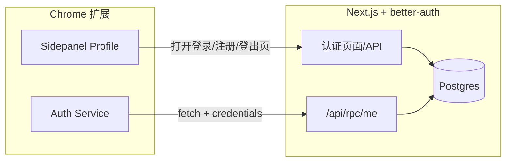
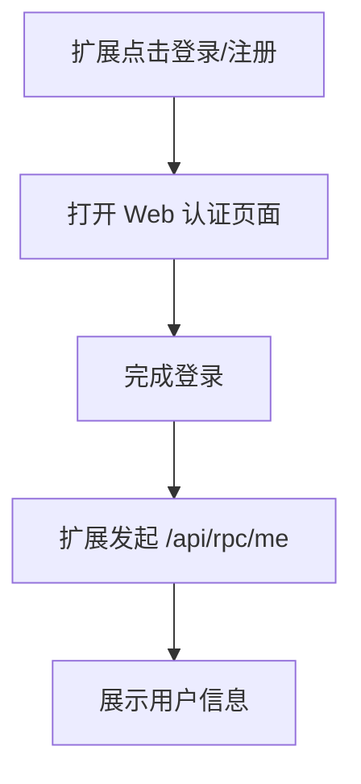
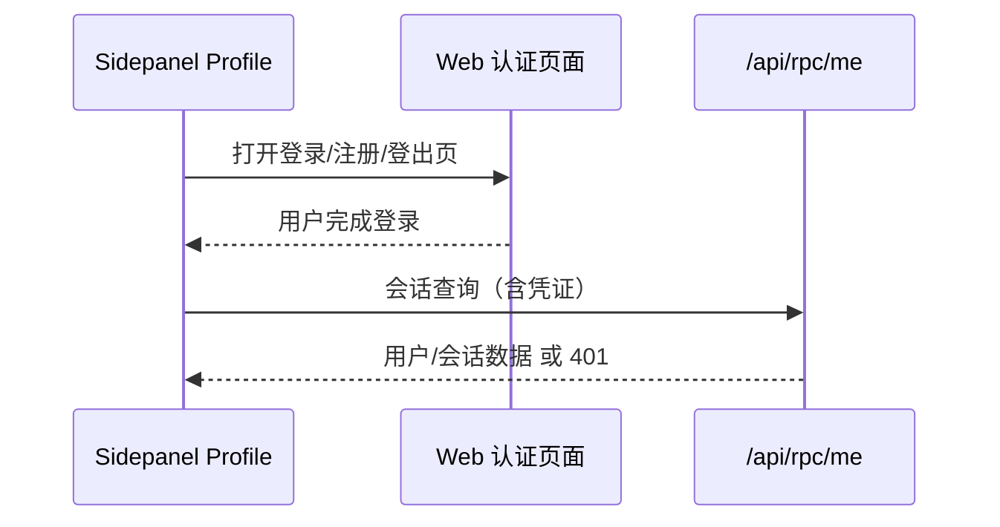

## 背景
后端已提供 better-auth 的登录/注册页面与会话能力。扩展侧通过 Web 页面完成认证，并使用跨域会话查询获取登录态。

## 目标 / 非目标
- 目标：
  - 支持扩展侧跨域携带凭证查询会话。
  - 提供 Web 登出页面，扩展可直接打开。
  - 支持 prod/dev/local 域名配置。
- 非目标：
  - OAuth（Google/GitHub/AppId）。
  - 扩展内忘记密码。
  - 付费/订阅落地。

## 关键决策
- 决策：为 `/api/auth` 与 `/api/rpc` 增加白名单 CORS 且允许 credentials。
  - 原因：扩展请求需要带 Cookie。
- 决策：提供 `/logout` 页面完成登出并重定向。
  - 原因：扩展只负责入口，不在扩展内实现登出逻辑。
- 决策：沿用 `/api/rpc/me` 作为会话查询端点。
  - 原因：现有实现可复用。
- 决策：本地允许列表仅在开发环境开启，生产环境禁止 `localhost`。
  - 原因：避免生产环境暴露本地来源。

## 系统架构图


## 用户流程图


## 关键交互序列图


## 数据契约（DTO）
> 约定：跨模块/前后端交互使用 `DTO` 后缀。

```ts
export type AuthUserDTO = {
  id: string;
  email: string;
  name?: string | null;
  image?: string | null;
  plan?: {
    id: string;
    name: string;
    status: 'trial' | 'active' | 'past_due' | 'canceled';
    trialEndsAt?: string | null;
  } | null;
};

export type AuthSessionDTO = {
  id: string;
  expiresAt: string;
};

export type AuthMeResponseDTO = {
  user: AuthUserDTO;
  session: AuthSessionDTO;
};

export type AuthErrorDTO = {
  status: number;
  message: string;
};
```

## 配置与域名策略
- 生产：`https://chat-aside.zilin.im`
- 开发：`https://dev-chat-aside.zilin.im`
- 本地：`http://localhost:3030`、`http://localhost:3000` 与 `http://localhost:3040`
- 允许来源通过环境变量配置（建议逗号分隔）。
- 本地域名只在开发环境允许，生产环境不允许 `localhost` 作为后端来源。

## 风险与权衡
- 跨域 Cookie 依赖后端 SameSite/secure 配置，若出现 Cookie 不发送需调整策略或使用本地 HTTPS。
- 需要明确扩展 ID 以加入 `chrome-extension://<id>` 允许列表。

## 安全风险与缓解
### 1) CSRF（跨站请求伪造）
- 风险：为支持扩展跨域会话，Cookie 需要 `SameSite=None`，会放开跨站携带 Cookie 的限制，提升 CSRF 风险。
- 缓解：
  - 所有有副作用的接口必须启用 CSRF 防护（CSRF Token / 双重提交 / Origin 校验）。
  - 对 `/api/auth` 与业务写接口做严格 `Origin` 校验与允许列表匹配。
  - 保持 `Access-Control-Allow-Origin` 精确匹配（禁止 `*` 且允许 `credentials` 时必须是具体来源）。

### 2) XSS（跨站脚本）
- 风险：一旦 Web 端存在 XSS，可读取非 HttpOnly Cookie 或发起恶意请求。
- 缓解：
  - 会话 Cookie 必须设置 `HttpOnly`、`Secure`。
  - 前端避免不可信 HTML 注入；必要时使用严格的 CSP。

### 3) 会话固定/盗用
- 风险：攻击者诱导用户复用固定会话或窃取会话。
- 缓解：
  - 登录/登出后强制轮换会话标识。
  - 服务端记录会话绑定信息（如设备指纹/IP）并限制异常行为。

### 4) CORS 放行配置误用
- 风险：放行范围过大可能导致任意站点带 Cookie 访问受保护接口。
- 缓解：
  - 仅允许白名单来源（含扩展 ID）。
  - 生产环境禁止 `localhost` 来源。
  - 每次响应设置 `Vary: Origin`，避免缓存污染。

### 5) 配置可被滥用
- 风险：基础域名或允许来源配置若被错误放宽，可能造成钓鱼或越权访问。
- 缓解：
  - 仅通过环境变量注入允许来源，不提供运行时可编辑入口。
  - 发布时核对允许列表与扩展 ID。

## 上线准备 SOP（Cookie 会话）
### 1) CSRF 防护（必须）
- 检查点：所有有副作用的接口（注册/登录/登出/写数据）是否具备 CSRF 防护。
- 通过标准：
  - CSRF Token 校验，或
  - 严格 `Origin/Referer` 校验（未在白名单直接拒绝）。
- 不通过处理：补齐 CSRF Token 或 Origin 校验逻辑。

### 2) Cookie 安全属性（HttpOnly / Secure / SameSite=None）
- 检查点：登录后 `Set-Cookie` 是否包含 `HttpOnly`、`Secure`、`SameSite=None`。
- 通过标准：三项齐全且生效。
- 不通过处理：调整认证配置/中间件，确保三项齐全。

### 3) CORS 白名单（精确匹配 + 生产禁 localhost）
- 检查点：生产环境是否只允许明确来源（prod 域名 + 扩展 ID）。
- 通过标准：
  - `AUTH_ALLOWED_ORIGINS` 仅含 `https://chat-aside.zilin.im` 与 `chrome-extension://<prod-id>`。
  - 不包含 `localhost`。
  - `Access-Control-Allow-Origin` 精确匹配，且设置 `Vary: Origin`。
- 不通过处理：修正 `.env` 与 `proxy` 允许列表。

### 4) XSS 风险控制
- 检查点：是否存在不可信 HTML 注入。
- 通过标准：
  - 不直接渲染不可信 HTML（或经过净化）。
  - 配置 CSP（限制 `script-src`）。
- 不通过处理：清理注入点/补充 CSP。

### 5) 会话固定/盗用防护
- 检查点：登录/登出是否轮换会话；旧会话是否失效。
- 通过标准：
  - 登录后会话 ID 轮换。
  - 登出后旧会话失效。
- 不通过处理：补齐会话轮换与失效逻辑。

### 6) 配置滥用防护
- 检查点：允许来源是否仅通过环境变量注入。
- 通过标准：
  - 运行时无可编辑入口。
  - 发布前核对扩展 ID 与生产域名。
- 不通过处理：移除运行时可编辑配置。

### 7) 扩展发布核对
- 检查点：扩展 `host_permissions` 与后端 CORS 是否一致。
- 通过标准：
  - 扩展仅包含生产域名 host 权限。
  - 后端允许来源包含生产扩展 ID。
- 不通过处理：同步修正扩展 manifest 与后端允许列表。

## 登录态同步限制与可选方案
### 当前限制
- 现实现基于内容脚本在页面加载时发送 `AUTH_REFRESH`，如果登录页是 SPA 路由切换且未刷新页面，则不会重新触发内容脚本。
- 结果：用户完成登录后，sidepanel 只有在获得焦点/可见性变化或手动刷新时才会更新。

### 可选方案
#### 方案 A1：登录页主动通知扩展
- 做法：登录成功后在页面内 `postMessage('AUTH_REFRESH')`，内容脚本监听并转发给扩展。
- 优点：触发准确、延迟低。
- 缺点：需要修改登录页代码。

#### 方案 A2：内容脚本监听 SPA 路由变化
- 做法：监听 `history.pushState/replaceState` 或 URL 变化，路由变化时发送 `AUTH_REFRESH`。
- 优点：无需改登录页。
- 缺点：可能产生冗余触发，需要去抖或条件过滤。

#### 方案 A3：登录页短时轮询会话
- 做法：在登录/注册页面短时轮询 `/api/rpc/me`，检测到已登录后发送 `AUTH_REFRESH`。
- 优点：无需改登录页，触发可靠。
- 缺点：额外请求开销。

## 迁移计划
1. 增加 CORS 白名单与 credentials 支持。
2. 新增 `/logout` 页面。
3. 验证 dev/prod/local 域名。

## 待确认
- 生产扩展 ID（用于允许 `chrome-extension://<id>`）。
