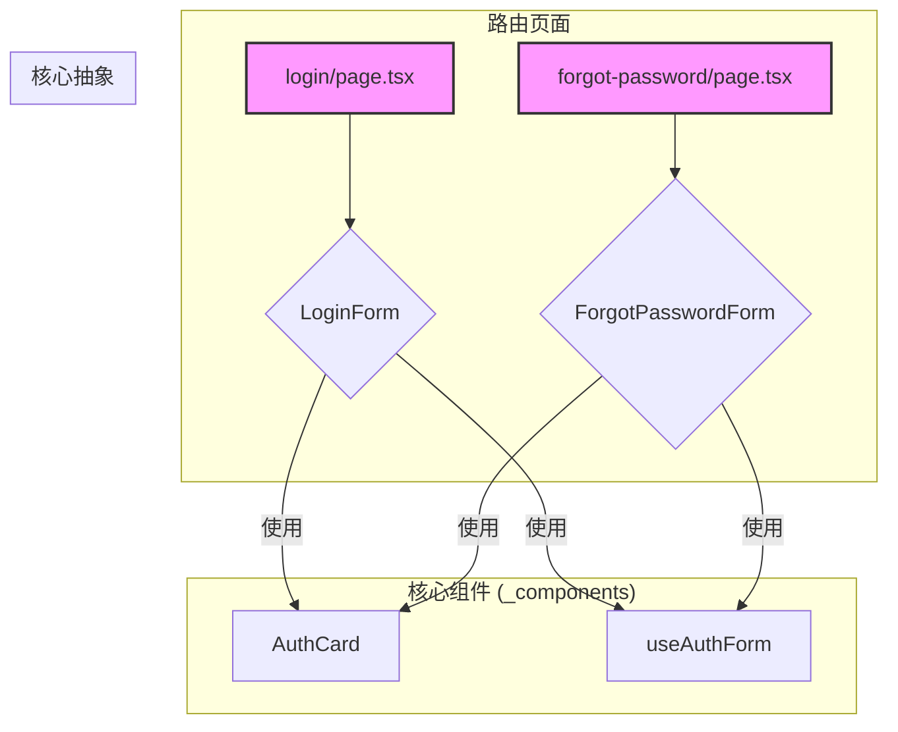

# 认证 (Auth) 模块说明

本文档旨在帮助新成员快速理解本项目的认证模块，包括其设计、文件结构和维护方法。

## 1. 模块概述

本模块负责处理应用的所有用户认证功能，包括：

- 用户注册 (`/signup`)
- 用户登录 (`/login`)
- 忘记密码 (`/forgot-password`)
- 重置密码 (`/reset-password`)

它基于 Next.js 的 App Router 构建，并遵循关注点分离的原则。

## 2. 核心技术栈

- **框架**: [Next.js (App Router)](https://nextjs.org/docs) - 用于构建页面和路由。
- **认证库**: [better-auth](https://www.better-auth.com/) - 处理核心认证逻辑，如 session 管理、密码哈希和外部登录提供商。
- **数据库 ORM**: [Drizzle ORM](https://orm.drizzle.team/) - 用于与 PostgreSQL 数据库进行交互。
- **邮件服务**: [Resend](https://resend.com/) - 用于发送密码重置等交易性邮件。
- **UI**: [Tailwind CSS](https://tailwindcss.com/) & [shadcn/ui](https://ui.shadcn.com/) - 构建组件和样式。

## 3. 文件结构与关系

认证模块的所有文件都位于 `src/app/(auth)/` 目录下。

```
src/app/(auth)/
├── _components/            # 存放所有认证相关的React组件
│   ├── auth-card.tsx       # 【核心】可重用的认证卡片UI外壳
│   ├── login-form.tsx      # 登录表单
│   ├── signup-form.tsx     # 注册表单
│   ├── forgot-password-form.tsx # 忘记密码表单
│   └── reset-password-form.tsx  # 重置密码表单
├── login/
│   └── page.tsx            # 登录页面
├── signup/
│   └── page.tsx            # 注册页面
├── forgot-password/
│   └── page.tsx            # 忘记密码页面
└── reset-password/
    └── page.tsx            # 重置密码页面
```

- **(auth) 路由组**: 括号 `()` 表示这是一个路由组，它不会影响 URL 路径，主要用于组织文件结构，或为组内所有路由共享一个布局。
- **page.tsx**: 每个路由目录下的 `page.tsx` 是该路由的入口页面。它的职责非常单一：**仅作为相应表单组件的容器**。
- **\_components/**: 下划线 `_` 表示这是一个私有文件夹，Next.js 不会将其作为路由处理。这里存放着所有认证功能的 UI 和逻辑核心。

### 核心抽象

为了保持代码的DRY (Don't Repeat Yourself)，我们创建了两个核心抽象：

1. **`AuthCard` 组件** (`_components/auth-card.tsx`): 这是一个可重用的UI组件，封装了所有认证表单（登录、注册等）共享的卡片式布局，包括标题、描述和页脚链接。
2. **`useAuthForm` 钩子** (`src/hooks/use-auth-form.ts`): 这是一个自定义React钩子，封装了表单通用的状态管理逻辑，如 `loading`, `error`, `success` 状态，以及异步提交的 `try/catch` 逻辑。

## 4. 组件关系

下图展示了页面、表单和核心抽象之间的关系：



## 5. 数据流

1. **用户交互**: 用户在某个表单组件（如 `LoginForm`）中输入信息并点击提交。
2. **表单处理**: `handleSubmit` 函数被触发，它调用 `useAuthForm` 钩子返回的 `formAction`。
3. **客户端库**: `formAction` 内部调用从 `~/lib/auth-client` 导入的函数（如 `signIn.email`）。
4. **API 请求**: `auth-client` 函数向后端的 `better-auth` API 路由 (`/api/auth/...`) 发送一个 `POST` 请求。
5. **后端处理**:
   - `better-auth` 接收请求，并根据操作（如登录）执行相应逻辑。
   - 它通过 Drizzle ORM 与数据库交互（查询用户、验证密码等）。
   - 如果需要发送邮件（如密码重置），它会调用 `Resend` 服务。
6. **返回响应**: 后端将结果返回给客户端，`useAuthForm` 钩子自动更新 `success` 或 `error` 状态，UI随之刷新。

## 6. 如何维护

### 添加一个新的认证页面 (例如 "验证邮件")

1. **创建路由**: 在 `src/app/(auth)/` 下创建 `verify-email/page.tsx`。
2. **创建表单组件**: 在 `src/app/(auth)/_components/` 下创建 `verify-email-form.tsx`。
3. **构建表单**: 在 `verify-email-form.tsx` 中，使用 `AuthCard` 和 `useAuthForm` 快速构建你的表单UI和逻辑。
4. **连接页面和组件**: 在 `verify-email/page.tsx` 中，导入并渲染 `VerifyEmailForm` 组件。

### 数据库 Schema 变更

所有数据库的表结构定义在 `src/server/db/schema.ts` 中。

**重要**: **不要手动修改数据库**。所有的 schema 变更都必须通过修改 `schema.ts` 文件，然后运行以下命令来推送变更：

```bash
pnpm db:push
```

如果你需要生成迁移文件（更适用于生产环境），可以运行：

```bash
pnpm db:generate
```
